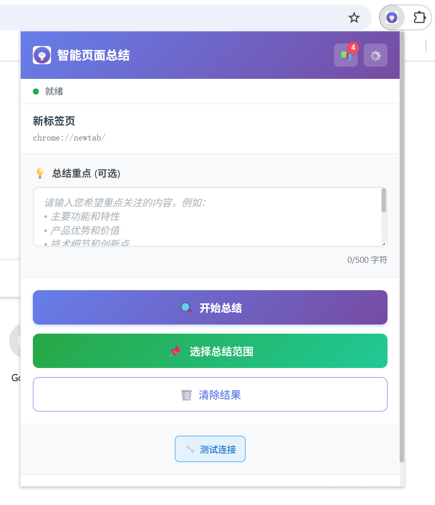
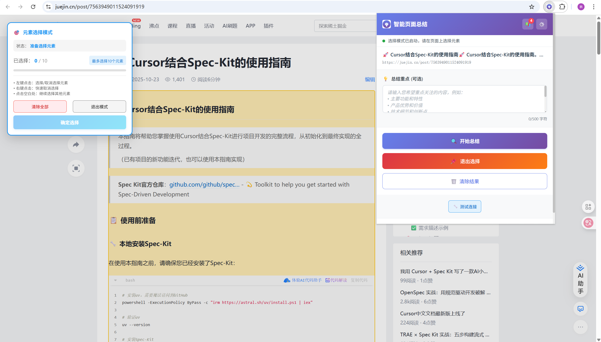
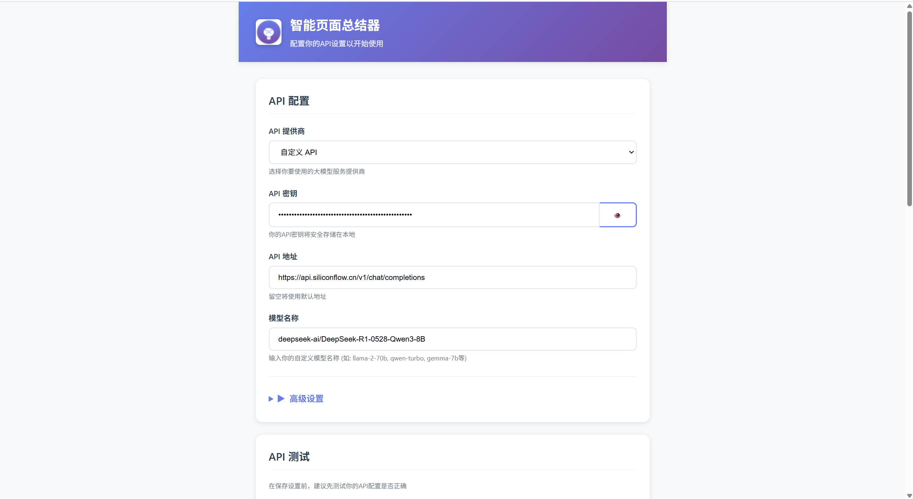

# 智能页面总结器 (AI Page Summary)

[](https://chrome.google.com/webstore)
[](https://github.com)
[](LICENSE)

一个功能强大的 Chrome 浏览器扩展程序，使用 AI 技术智能总结网页内容。支持多种大模型 API（OpenAI GPT、Anthropic Claude 等），帮助您快速获取网页核心信息。

## 📸 界面展示

### 扩展主界面

*扩展打开时的主界面展示*

### 支持选择页面元素进行总结/对话

*页面元素选择时的界面展示*

## ✨ 主要特性

### 🎯 核心功能
- **智能内容提取** - 自动识别和提取页面主要内容，过滤广告、导航等无关信息
- **多模型支持** - 支持 OpenAI GPT、Anthropic Claude 及自定义 API 端点
- **优化提示词** - 专门设计的高质量提示词，确保 AI 生成客观、准确的总结
- **实时处理** - 快速处理页面内容，生成高质量总结
- **置信度评估** - 对总结结果进行质量评估和置信度分析

### 🎨 用户体验
- **现代化界面** - 美观的渐变色设计，响应式布局
- **多种交互方式** - 点击按钮、右键菜单、快捷键操作
- **历史记录管理** - 保存和查看所有总结历史，支持导出
- **结果导出** - 支持复制到剪贴板、导出为文本文件

### ⚙️ 配置管理
- **安全存储** - API 密钥本地加密存储，保护用户隐私
- **高级参数** - 温度、Token 数、总结长度等可自定义
- **API 测试** - 在保存前测试 API 配置是否正确
- **设置导入导出** - 便于迁移和备份

## 🚀 快速开始

### 安装步骤

1. **克隆或下载项目**
   ```bash
   git clone <repository-url>
   cd ai_page_summary
   ```

2. **打开 Chrome 扩展管理页面**
   - 访问 `chrome://extensions/`
   - 开启右上角的"开发者模式"

3. **加载扩展**
   - 点击"加载已解压的扩展程序"
   - 选择 `chrome-extension` 目录

4. **配置 API**
   - 点击扩展图标
   - 在弹出页面中点击设置按钮（⚙️）
   - 输入你的 API 密钥和配置信息
   - 测试 API 连接并保存设置

### 使用方法

#### 快速总结
1. 打开任意网页
2. 点击浏览器工具栏中的扩展图标
3. 点击"开始总结"按钮
4. 等待 AI 分析并查看结果

#### 快捷键操作
- `Ctrl+Shift+S` (Windows/Linux) 或 `Cmd+Shift+S` (Mac)：快速总结当前页面
- `Ctrl+Shift+O` (Windows/Linux) 或 `Cmd+Shift+O` (Mac)：打开设置页面

#### 右键菜单
- 在任意网页上右键点击
- 选择"智能总结此页面"

## 📁 项目结构

```
ai_page_summary/
├── chrome-extension/          # Chrome 扩展主目录
│   ├── manifest.json          # 扩展配置文件
│   ├── popup.html             # 主弹出页面
│   ├── options.html           # 设置页面
│   ├── js/                    # JavaScript 脚本
│   │   ├── background.js      # 后台服务脚本
│   │   ├── content.js         # 内容提取脚本
│   │   ├── popup.js           # 主界面逻辑
│   │   ├── options.js         # 设置页面逻辑
│   │   ├── utils.js           # 工具函数库
│   │   └── ...                # 其他功能脚本
│   ├── styles/                # 样式文件
│   │   ├── popup.css          # 主界面样式
│   │   ├── options.css        # 设置页面样式
│   │   └── content.css        # 内容脚本样式
│   ├── icons/                 # 扩展图标
│   ├── README.md              # 扩展详细说明
│   └── INSTALL.md             # 安装指南
├── docs/                      # 项目文档
│   ├── 1. Chrome 扩展开发经验教训总结.md
│   ├── AI网页总结器扩展测试报告.md
│   └── ...                    # 其他文档
└── README.md                  # 项目主文档（本文件）
```

## 🔧 技术架构

### 核心技术
- **Chrome Extension Manifest V3** - 使用最新的扩展 API
- **原生 JavaScript** - 无框架依赖，轻量高效
- **Chrome Storage API** - 本地数据存储
- **Fetch API** - 与 AI 服务通信

### 核心组件

#### 1. Content Script (`content.js`)
- 智能内容提取算法
- 页面结构分析
- 内容质量评估
- 无关信息过滤

#### 2. Background Service (`background.js`)
- API 调用处理
- 设置存储管理
- 上下文菜单创建
- 消息传递中介

#### 3. Popup Interface (`popup.html/js`)
- 用户界面控制
- 总结结果显示
- 历史记录管理
- 文件导出功能

#### 4. Options Page (`options.html/js`)
- API 配置管理
- 高级参数设置
- API 连接测试
- 使用说明

## ⚙️ 配置说明

### 配置页面

*后台配置页面截图*

### API 提供商设置

#### OpenAI (GPT)
- **API 地址**：留空使用默认 `https://api.openai.com/v1/chat/completions`
- **模型选择**：
  - GPT-3.5 Turbo (推荐，性能与价格平衡)
  - GPT-4 (更高质量，但较慢和昂贵)
  - GPT-4 Turbo Preview (最新版本)
- **API 密钥格式**：以 `sk-` 开头

#### Anthropic (Claude)
- **API 地址**：留空使用默认 `https://api.anthropic.com/v1/messages`
- **模型选择**：
  - Claude 3 Haiku (推荐，速度快)
  - Claude 3 Sonnet (平衡性能)
  - Claude 3 Opus (最高质量)
- **API 密钥**：标准格式密钥

#### 自定义 API
- **API 地址**：输入你的自定义 API 端点
- **认证方式**：根据你的 API 服务调整
- **支持格式**：OpenAI 兼容格式或自定义格式

### 高级设置

#### 温度参数 (Temperature)
- **范围**：0.0 - 1.0
- **推荐值**：0.3
- **说明**：控制输出的随机性，较低值产生更一致的总结

#### 最大 Token 数
- **范围**：100 - 4000
- **推荐值**：1500
- **说明**：控制总结的最大长度

#### 总结长度偏好
- **简洁**：100-200 字，适用于快速浏览
- **中等**：300-500 字，推荐设置
- **详细**：800-1200 字，适用于深度阅读

## 🛡️ 隐私与安全

### 数据安全
- **本地存储** - 所有敏感信息（API 密钥）仅存储在用户本地浏览器中
- **加密保护** - 使用 Base64 编码保护存储的 API 密钥
- **无数据上传** - 页面内容和总结结果不会上传到第三方服务器

### 权限说明
- **activeTab** - 读取当前标签页内容
- **storage** - 保存用户配置
- **scripting** - 注入内容脚本
- **contextMenus** - 创建右键菜单

### 隐私承诺
- ✅ 不会收集或存储你的浏览历史
- ✅ 不会上传你的个人信息
- ✅ 不会在未经许可的情况下访问其他网站
- ✅ 所有处理在本地进行

## 🎯 使用场景

### 学术研究
- 快速总结学术论文和研究报告
- 提取研究方法、结论和关键数据
- 支持多种学术文档格式

### 新闻阅读
- 快速获取新闻要点
- 提取 5W1H 关键信息
- 保持新闻的客观性

### 技术文档
- 总结技术文章和教程
- 提取重要的配置和方法
- 保持技术术语的准确性

### 商务应用
- 总结产品页面和营销内容
- 提取关键卖点和规格信息
- 避免营销性语言的影响

## 🔍 故障排除

### 常见问题

#### 1. 扩展无法正常工作
- **检查权限**：确保扩展已正确加载且权限充足
- **刷新页面**：刷新网页后重试
- **重新安装**：卸载后重新安装扩展

#### 2. API 调用失败
- **验证 API 密钥**：检查密钥是否正确且有效
- **检查网络连接**：确保可以访问 API 服务器
- **确认账户余额**：检查 API 账户是否有足够余额
- **测试 API 配置**：在设置页面使用 API 测试功能

#### 3. 内容提取不准确
- **检查页面类型**：某些特殊页面可能需要手动调整
- **等待页面加载完成**：确保页面完全加载后再使用
- **检查页面结构**：对于动态内容可能需要滚动触发加载

#### 4. 总结质量不佳
- **调整参数**：尝试不同的温度和 Token 设置
- **选择合适的模型**：更高级的模型通常产生更好的结果
- **分段处理**：对于很长的内容，考虑分段总结

### 调试方法

1. **打开开发者工具**
   - 右键点击扩展图标
   - 选择"检查弹出内容"

2. **查看控制台日志**
   - F12 打开开发者工具
   - 查看 Console 面板的错误信息

3. **检查网络请求**
   - 在 Network 面板查看 API 调用状态
   - 确认请求和响应格式

## 📝 更新日志

### v1.0.0 (2025-11-12)
- ✨ 初始版本发布
- ✨ 支持 OpenAI 和 Anthropic API
- ✨ 智能内容提取和过滤
- ✨ 美观的用户界面设计
- ✨ 完整的历史记录功能
- ✨ 多样化的交互方式
- ✨ 响应式设计支持

## 🤝 贡献指南

欢迎提交问题报告和功能建议！

### 如何贡献
1. Fork 本项目
2. 创建特性分支 (`git checkout -b feature/AmazingFeature`)
3. 提交更改 (`git commit -m 'Add some AmazingFeature'`)
4. 推送到分支 (`git push origin feature/AmazingFeature`)
5. 发起 Pull Request

### 开发环境
- Chrome/Edge 浏览器 (版本 88+)
- 基本的 HTML、CSS、JavaScript 知识
- Chrome 扩展开发基础

## 📄 许可证

本项目采用 MIT 许可证 - 查看 [LICENSE](LICENSE) 文件了解详情。

## 📚 相关文档

- [扩展详细说明](chrome-extension/README.md)
- [安装指南](chrome-extension/INSTALL.md)
- [项目完成总结](chrome-extension/PROJECT_SUMMARY.md)
- [开发经验总结](docs/1.%20Chrome%20扩展开发经验教训总结.md)

## 🙏 致谢

感谢所有为本项目做出贡献的开发者！

---

**如有问题或建议，请提交 Issue 或联系开发者。**

**祝您使用愉快！** 🎉

