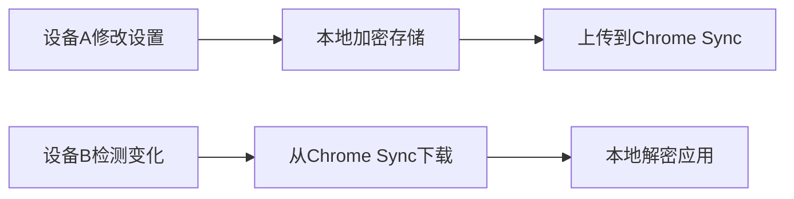
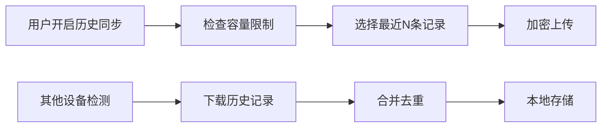

# Chrome扩展跨设备API设置同步方案（增强版）

## 🎯 核心功能设计

### 1. 同步数据范围

**默认同步（API设置）：**
- ✅ API提供商选择（OpenAI/Anthropic/Custom）
- ✅ API密钥（加密存储）
- ✅ 自定义API端点URL
- ✅ 模型名称
- ✅ 其他偏好设置

**可选同步（历史记录）：**
- 🏷️ **新增**：总结历史记录同步功能
- 🔒 **默认状态**：**关闭**（保护用户隐私）
- ⚙️ **用户控制**：设置页面提供独立开关
- 📊 **容量管理**：支持选择性同步（最近N条记录）

### 2. 技术架构优化

**存储策略分层：**
```
chrome.storage.sync (跨设备同步)
├── API设置 (always sync)
│   ├── provider
│   ├── encryptedApiKey
│   ├── apiUrl
│   └── modelName
├── 同步偏好 (always sync)
│   ├── syncHistory: false (默认)
│   ├── maxHistoryItems: 50
│   └── syncLastSync: timestamp
└── 历史记录 (conditional sync)
    └── historyItems[] (only if syncHistory = true)
```

**数据容量优化：**
- API设置：< 2KB（实时同步）
- 历史记录：每条约1-2KB，建议最多50条（可选同步）
- 总容量控制：< 100KB（Chrome sync限制）

### 3. 用户界面设计

#### 设置页面新增选项
```html
<!-- 同步设置区域 -->
<div class="sync-settings">
  <h3>🔄 跨设备同步</h3>
  
  <div class="sync-status">
    <span class="sync-indicator">🟢</span>
    <span>同步状态：已连接</span>
  </div>
  
  <div class="sync-toggle">
    <label>
      <input type="checkbox" id="syncHistory">
      <span class="toggle-slider"></span>
    </label>
    <div class="toggle-info">
      <strong>同步总结历史记录</strong>
      <p>将您的总结历史记录同步到其他设备（默认关闭，保护隐私）</p>
    </div>
  </div>
  
  <div class="history-sync-options" id="historySyncOptions" style="display: none;">
    <label for="maxHistoryItems">同步最近记录数：</label>
    <select id="maxHistoryItems">
      <option value="20">最近20条</option>
      <option value="50" selected>最近50条</option>
      <option value="100">最近100条</option>
    </select>
    <p class="hint">注意：同步过多历史记录可能影响同步速度</p>
  </div>
</div>
```

#### 同步状态指示器
- **API设置同步**：实时显示状态
- **历史记录同步**：仅在开启时显示状态
- **冲突检测**：智能提示用户选择

### 4. 同步流程设计

#### API设置同步（实时）


#### 历史记录同步（条件触发）


### 5. 隐私保护机制

**默认隐私优先：**
- 🔒 **历史记录同步默认关闭**
- 👁️ **用户明示授权**后才能同步
- 🗑️ **可随时关闭**同步功能
- 🚫 **可选择性删除**已同步的历史记录

**数据处理：**
- 历史记录内容经过加密
- 仅在用户设备本地解密
- 支持批量删除功能
- 清晰的数据来源标识

### 6. 冲突解决策略

#### API设置冲突
- **策略**：最后修改时间优先
- **提示**："设备A和设备B的设置不一致，已应用最新修改"

#### 历史记录冲突
- **策略**：合并去重 + 时间排序
- **规则**：
  1. 相同URL的历史记录去重（保留最新内容）
  2. 按时间倒序排列
  3. 超出容量限制时删除最旧的记录

### 7. 性能优化

**容量管理：**
- 历史记录分批同步（每批10条）
- 智能压缩（去除HTML标签，保留核心内容）
- 增量同步（仅同步变化的部分）

**错误处理：**
- 同步失败自动重试（最多3次）
- 容量超限时提示用户清理
- 网络断开时的离线缓存

## 📋 实施计划

### 第一阶段：基础框架
1. ✅ 设计同步数据架构
2. 🔄 实现Chrome storage sync基础功能
3. 🔄 添加API设置加密存储
4. 🔄 实现跨设备同步机制

### 第二阶段：历史记录功能
1. 🔄 添加历史记录同步开关
2. 🔄 实现历史记录加密同步
3. 🔄 添加容量管理和冲突处理
4. 🔄 优化用户界面和状态显示

### 第三阶段：用户体验
1. 🔄 添加详细的同步状态反馈
2. 🔄 实现选择性同步功能
3. 🔄 跨设备测试和性能优化
4. 🔄 错误处理和重试机制

## 🔧 技术实现要点

### 关键代码结构
```javascript
// 同步管理类
class SyncManager {
  constructor() {
    this.syncHistory = false;
    this.maxHistoryItems = 50;
    this.lastSyncTime = 0;
  }
  
  // 切换历史记录同步
  async toggleHistorySync(enabled) {
    if (enabled && !this.syncHistory) {
      // 首次开启时，同步历史记录
      await this.syncHistoryItems();
    }
    this.syncHistory = enabled;
    await this.saveSyncPrefs();
  }
  
  // 同步历史记录
  async syncHistoryItems() {
    const items = await this.getRecentHistoryItems(this.maxHistoryItems);
    const encryptedItems = await this.encryptItems(items);
    await chrome.storage.sync.set({ historyItems: encryptedItems });
  }
  
  // 加密工具
  async encryptItems(items) {
    // AES-GCM加密实现
  }
}
```

## 📊 预期效果

### 用户体验提升
- ✅ **无缝切换设备**：API设置即时同步
- ✅ **隐私自主控制**：历史记录同步可开关
- ✅ **容量友好**：智能管理同步数据量
- ✅ **状态透明**：清晰的同步状态显示

### 安全隐私保障
- 🔒 **默认安全**：敏感功能默认关闭
- 🔐 **端到端加密**：所有数据加密传输
- 🛡️ **用户掌控**：完全的用户授权机制
- 🚫 **可逆操作**：随时可以关闭同步

## 总结

这个增强版方案在保持简洁的同时，给用户提供了灵活的选择权：
- **API设置**：必须同步，保证使用连续性
- **历史记录**：可选同步，用户隐私优先
- **默认配置**：安全第一，最小授权原则

您觉得这个方案如何？我可以开始实施开发！
